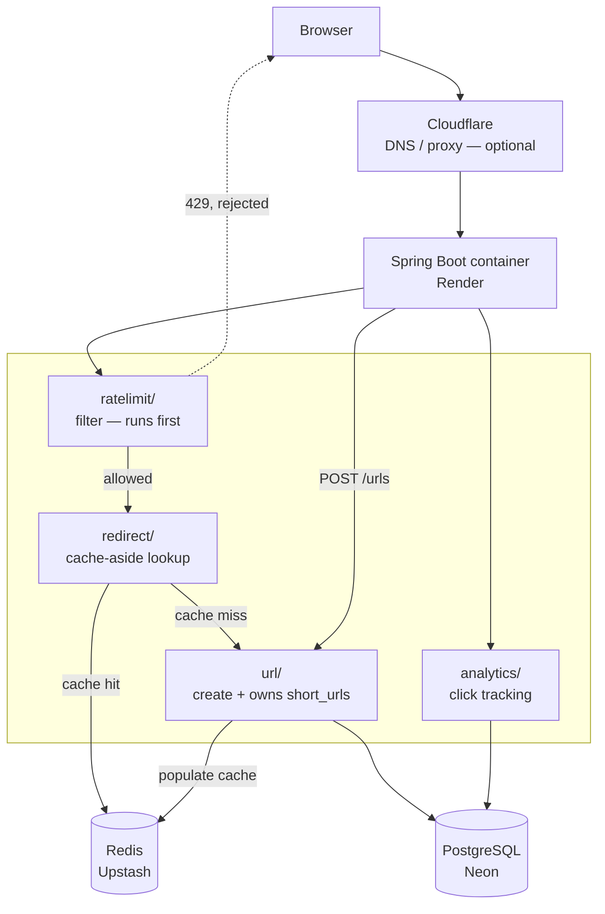

# shorturl


A production-ready URL shortening service built as a **modular monolith** and
grown through deliberate, redeployable phases — complexity is added only when
justified by requirements or measured performance, never by habit.

## Table of Contents

- [shorturl](#shorturl)
  - [Table of Contents](#table-of-contents)
  - [Overview](#overview)
  - [Tech Stack](#tech-stack)
  - [Architecture](#architecture)
  - [Project Structure](#project-structure)
  - [Getting Started](#getting-started)
    - [Prerequisites](#prerequisites)
    - [Build](#build)
    - [Run](#run)
  - [Configuration](#configuration)
  - [API](#api)
  - [Roadmap](#roadmap)
  - [Design Documentation](#design-documentation)
  - [License](#license)

## Overview

The service creates short, random Base62 aliases for long URLs and redirects
visitors from the alias to the original target. It is designed to stay honest
about scale: every phase ships, deploys, and is measured before the next piece
of infrastructure is introduced.

Guiding decisions:

- **Modular monolith** — one deployable unit, strict internal module boundaries
  enforced by Java package-private visibility.
- **Containerized** — a long-running Spring Boot container, avoiding JVM cold
  starts and keeping a persistent connection pool.
- **Cache-aside Redis** — introduced only after a Postgres-only latency
  baseline exists.

## Tech Stack

| Layer | Choice |
|---|---|
| Language / Framework | Java 21, Spring Boot 4.1.1 |
| Database | PostgreSQL (Neon) |
| Cache | Redis (Upstash) |
| Hosting | Render (Docker containers) |
| CDN / DNS | Cloudflare (optional) |
| Build | Maven / Gradle (wrapper) |

## Architecture



A redirect request flows: `ratelimit/` (reject early with `429`) →
`redirect/` (Redis cache-aside) → on a miss, calls `url/`'s service → Postgres →
cache populated → click recorded by `analytics/` → `302` back to the browser.

## Project Structure

```
src/main/java/dev/iwowa/shortener/
├── UrlShortenerApplication.java
│
├── url/                          # module: creating + storing short URLs
│   ├── UrlController.java
│   ├── UrlService.java
│   ├── ShortUrl.java             (entity)
│   ├── ShortUrlRepository.java
│   ├── CodeGenerator.java
│   ├── UrlValidator.java
│   └── dto/
│       ├── CreateUrlRequest.java
│       └── CreateUrlResponse.java
│
├── redirect/                     # module: resolving a code -> cache-aside lookup
│   ├── RedirectController.java
│   └── RedirectService.java
│
├── ratelimit/                    # module: request throttling
│   ├── RateLimiterService.java
│   └── RateLimitFilter.java
│
├── analytics/                    # module: click tracking
│   ├── ClickEvent.java
│   ├── ClickEventRepository.java
│   └── ClickTracker.java
│
└── common/                       # only things genuinely shared across modules
    ├── RedisConfig.java
    └── GlobalExceptionHandler.java
```

| Module | Responsibility | Owns |
|---|---|---|
| `url/` | Create short codes, validate + store target URLs | `short_urls` table |
| `redirect/` | Resolve a code to a target URL, cache-aside | — (calls `url/`'s service) |
| `ratelimit/` | Throttle requests per IP before anything else | Redis counter keys |
| `analytics/` | Record click events | `click_events` table |
| `common/` | Cross-cutting infra only | — |

## Getting Started

### Prerequisites

- JDK 21
- Maven or Gradle (wrapper included — use `./mvnw` / `./gradlew`)
- A PostgreSQL database (Neon or local)
- A Redis instance (Upstash or local) — required from Phase 2 onward

### Build

```bash
./mvnw clean package     # or ./gradlew build
```

### Run

```bash
./mvnw spring-boot:run   # or ./gradlew bootRun
```

The application starts on `http://localhost:8080` by default.

## Configuration

Configuration is provided via environment variables:

| Variable | Description |
|---|---|
| `DATABASE_URL` | PostgreSQL JDBC connection URL |
| `DATABASE_USERNAME` | PostgreSQL user |
| `DATABASE_PASSWORD` | PostgreSQL password |
| `REDIS_URL` | Redis connection string (`rediss://` for TLS) |
| `PORT` | HTTP port (defaults to `8080`) |

> Redis variables are required only from Phase 2 onward.

## API

| Method | Path | Description | Response |
|---|---|---|---|
| `POST` | `/urls` | Create a short URL from a target URL | `201` with the short code/link |
| `GET` | `/{code}` | Resolve a short code | `302` redirect, or `404` if not found |
| — | any | Rate-limited requests | `429 Too Many Requests` |

Request and response bodies are defined by
`url/dto/CreateUrlRequest.java` and `url/dto/CreateUrlResponse.java`.

## Roadmap

Each phase ends in a redeploy; nothing is added before the previous phase gives
a concrete reason to need it.

- [ ] **Phase 0 — MVP** — `url/` + `redirect/` only, Postgres, no Redis, no rate limiting, no analytics
- [ ] **Phase 1 — Validation + expiry** — reject malformed/non-http(s) URLs, add `expires_at`
- [ ] **Phase 2 — Redis cache-aside** — introduced against the Phase 0–1 latency baseline
- [ ] **Phase 3 — Rate limiting** — Redis fixed-window, per-IP, checked first in the pipeline
- [ ] **Phase 4 — SSRF/abuse protection** — scheme allowlist and private-IP checks, pure logic
- [ ] **Phase 5 — Click analytics** — new table, salted IP hashes, sync-vs-async to be decided
- [ ] **Phase 6 — Load + chaos testing** — break Redis, then Postgres, measure and document results

## Design Documentation

The architecture and the reasoning behind every major decision live in the
project wiki:

- [Home](https://github.com/fl4nk3r-h/shorturl/wiki) — overview and roadmap
- [Architecture](https://github.com/fl4nk3r-h/shorturl/wiki/Architechture) — system design and data model
- [Architecture Decisions](https://github.com/fl4nk3r-h/shorturl/wiki/Architecture-Decisions) — full ADR log

## License

Not yet specified.